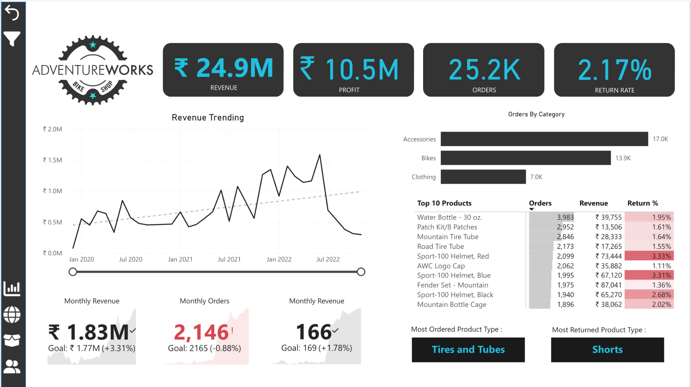
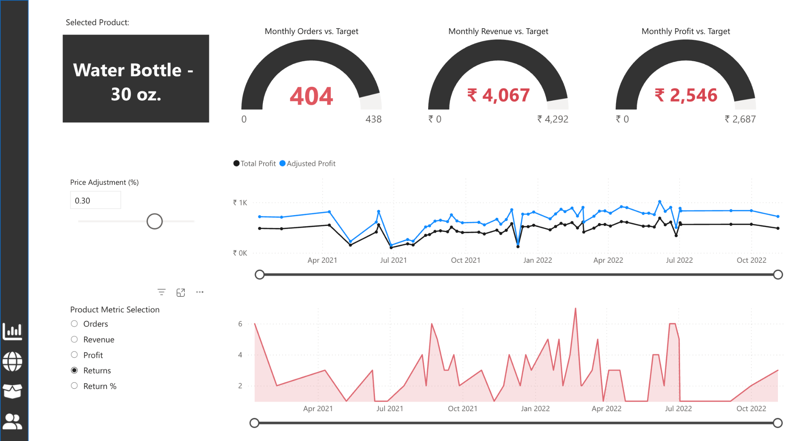
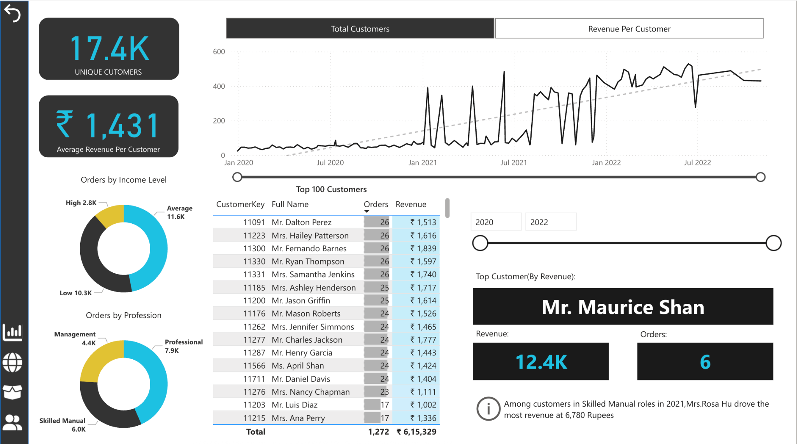

# Power-BI-Dashboard

# 📊 AdventureWorks Sales & Customer Analysis Dashboard

---

## 📁 Project Overview

This Power BI project presents an end-to-end **sales and customer performance dashboard** for *AdventureWorks Shop*. The dashboard visualizes key business metrics like revenue, profit, order trends, product performance, and customer segmentation — empowering decision-makers with actionable insights.

---

## 🎯 Key Highlights

- **Revenue**: ₹24.9M total
- **Profit**: ₹10.5M total
- **Orders**: 25.2K
- **Return Rate**: 2.17%
- **Top Product**: Tires and Tubes (most ordered)
- **Most Returned**: Shorts
- **Customer Insights**:
  - 17.4K unique customers
  - ₹1,431 average revenue per customer
  - Segmentation by income level and profession

---

## 📌 Features Included

- 📈 **Revenue & Profit Trend**: Line charts with forecasts
- 📦 **Top Products**: Ranked by orders, revenue, and return %
- 🎯 **Target vs Actual KPIs**: Monthly revenue, orders, profit
- 👥 **Customer Segmentation**: Based on income & profession
- 🧠 **Interactive Filtering**: Drill-down by category, product, and time
- 🔍 **Product Deep Dive**: Profit simulations using price adjustment

---

## 📸 Dashboard Screenshots

#### 1. **Executive Summary Dashboard**

#### 2. **Product Insights**

#### 3. **Customer Analysis**

---

## 📂 Files in this Repository

| File/Folder | Description |
|-------------|-------------|
| `AdventureWorksDashboard.pbix` | Main Power BI report file (not included here) |
| `README.md` | Project overview and documentation |
| `/screenshots/` | Contains visual snapshots of the dashboard |

---

## 🔧 Tools & Technologies

- **Power BI Desktop**
- **AdventureWorks Dataset** (sample business data)
- DAX Measures & Calculated Columns
- Slicers, Drillthrough, Forecasting

---

## 💡 Insights Gained

- Sales peaked mid-2022 but declined towards year-end.
- Product returns are highest in certain product lines (like Shorts).
- Water Bottles and Helmets are high volume but differ in return %.
- Certain customer professions generate more revenue than others.

---

## 📌 How to View

1. Download the `.pbix` file.
2. Open using [Power BI Desktop](https://powerbi.microsoft.com/desktop/).
3. Explore filters, visuals, and slicers interactively.

---

## 🙋‍♂️ Author

**Vrund Patel**  
B.Tech Data Science | Passionate about turning data into insights
